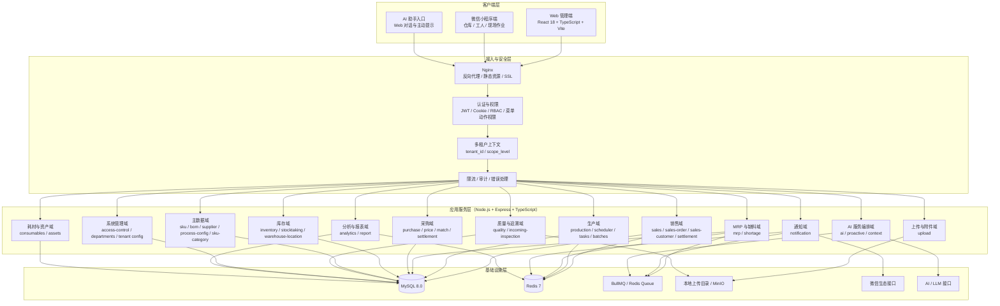
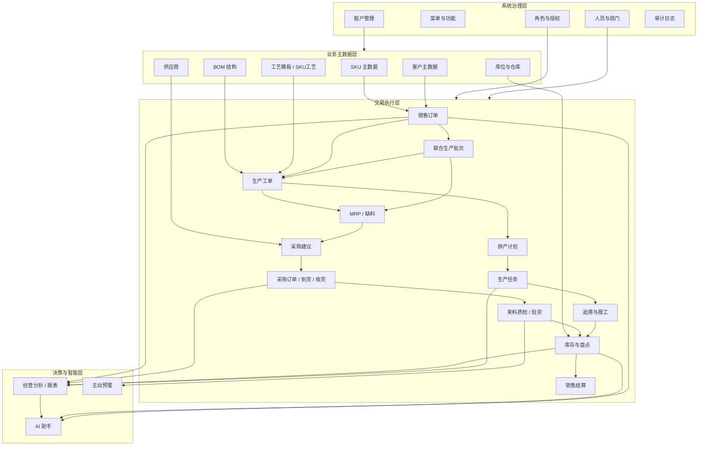
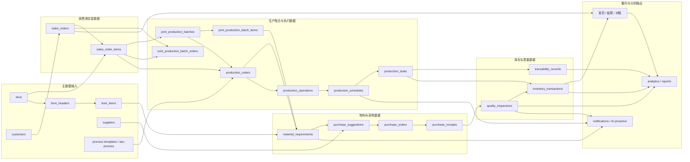

# 智造管家项目介绍报告图

更新日期：2026-04-23

适用对象：
- 客户汇报
- 内部方案评审
- 新成员项目快速入门

报告范围：
- Web 管理端
- 微信小程序端
- API 服务
- 多租户、联合生产批次、采购建议、库存、质检与追溯主链路

---

## 1. 整体业务流程图

```mermaid
flowchart LR
    A[客户需求 / 销售机会] --> B[客户主数据维护]
    B --> C[销售订单创建<br/>单订单多 SKU]
    C --> D{订单履约策略}
    D -->|单单生产| E[直接生成生产工单]
    D -->|多订单合并生产| F[联合生产批次<br/>joint_production_batches]
    F --> E

    C --> G[销售约束校验<br/>库存 / 产能 / 交期 / 紧急插单]
    G --> H[订单审批 / 状态流转]
    H --> E

    E --> I[BOM 展开 + 工艺快照]
    I --> J[物料需求计划 MRP<br/>material_requirements]
    J --> K{是否缺料}
    K -->|是| L[缺料看板]
    L --> M[AI采购建议 / 采购建议管理]
    M --> N[采购订单]
    N --> O[到货 / 收货]
    O --> P[来料质检]
    P -->|合格| Q[原料入库]
    P -->|不合格| R[退货 / 异常处理]
    Q --> S[排产计划]
    K -->|否| S

    S --> T[生产任务下发]
    T --> U[工人执行 / 报工 / 领退料]
    U --> V[半成品 / 成品入库]
    V --> W[验货 / 质检 / 溯源]
    W --> X[销售发货]
    X --> Y[销售结算]
    Y --> Z[经营分析 / 工资报表 / 库存报表]

    Q --> AA[库存总览 / 库位管理 / 盘点]
    V --> AA
    X --> AA
    U --> AB[通知中心]
    M --> AB
    S --> AB
    Z --> AC[AI 助手问答 / 主动预警]
```

### 业务链路解读

1. 销售端承接客户订单，已经支持“一个订单多个 SKU”。
2. 生产端在原有“订单明细 SKU -> 工单”主链上，新增了“联合生产批次”能力，支持多个订单合并投产。
3. 采购端由 MRP 和缺料看板驱动，既能按工单补料，也能按联合生产批次聚合补料。
4. 仓储、质检、追溯、发货、结算最终仍按原销售订单口径闭环，保证履约与财务口径清晰。

---

## 2. 系统架构图

### 架构要点

- 形态上是“模块化单体 + 多端接入”，而不是微服务拆散式结构。
- 业务主数据和交易数据以 MySQL 为中心，Redis 承担缓存、队列与实时计划缓存。
- 生产排程、采购建议、通知等异步能力通过 BullMQ 解耦。
- 当前已经落地“联合生产批次”扩展层，用于兼容多订单合并生产场景。

---

## 3. 核心模块详细说明

### 3.1 核心模块关系图

### 3.2 核心模块说明表

| 模块域 | 主要职责 | 关键页面 / 入口 | 关键 API / 服务 | 核心数据对象 |
| --- | --- | --- | --- | --- |
| 系统管理 | 多租户、菜单、角色、人员、部门、授权、审计 | `系统管理` 全套页面 | `access-control`, `departments` | `users`, `roles`, `permissions`, `audit_logs` |
| 主数据 | SKU、BOM、供应商、工艺、库位、客户 | `主数据`, `客户管理` | `sku`, `bom`, `supplier`, `process-config`, `sales-customer` | `skus`, `bom_headers`, `bom_items`, `suppliers`, `customers` |
| 销售 | 新建订单、订单管理、订单审批、结算、客户履约 | `销售订单管理`, `新建销售订单` | `sales-order`, `sales`, `settlement` | `sales_orders`, `sales_order_items` |
| 联合生产批次 | 多订单合并生产、批次聚合执行、来源回溯 | 销售订单管理中的联合批次入口 | `production-batch.service` | `joint_production_batches`, `joint_production_batch_orders`, `joint_production_batch_items` |
| 生产执行 | 工单生成、工艺快照、排产、任务、报工、任务推进 | `生产工单`, `排产计划`, `生产任务` | `production`, `scheduler`, `production-order` | `production_orders`, `production_operations`, `production_schedules`, `production_tasks` |
| MRP / 缺料 | BOM 展开、原料需求、缺料分析、补料驱动 | `缺料看板` | `mrp.service` | `material_requirements` |
| 采购 | AI采购建议、采购建议管理、采购订单、到货、收货、退货、结算、三单匹配 | `采购建议`, `采购订单`, `到货管理`, `入库记录` | `purchase`, `purchase-suggestion`, `threeWayMatch`, `incoming-inspection` | `purchase_suggestions`, `purchase_orders`, `purchase_order_items`, `purchase_receipts` |
| 库存 | 库存总览、库位、盘点、出入库流水、缸号/FIFO、多单位换算 | `库存总览`, `库存盘点` | `inventory`, `stocktaking` | `inventory`, `inventory_transactions`, `warehouses`, `locations` |
| 质量与追溯 | 来料质检、成品质检、验货、追溯、问题闭环 | `来料质检`, `追溯` | `quality`, `incoming-inspection` | `quality_inspections`, `traceability_records`, `inspection_records` |
| 报表分析 | 工资报表、库存报表、半成品模式、经营看板 | `分析`, `报表` | `analytics`, `report` | 聚合查询结果与分析指标 |
| AI 能力 | AI 助手、主动风险提示、上下文问答、建议编排 | 顶部 AI 入口 | `ai.service`, `proactive.service` | AI 上下文、预警结果、知识查询结果 |

### 3.3 当前项目的核心竞争力

- 业务主链完整：从销售订单到采购、生产、质检、库存、结算形成闭环。
- 多租户能力明确：租户隔离、权限快照、菜单与动作级授权已落地。
- 联合生产批次已支持：可以兼容“单订单逐单生产”与“多订单合并生产”。
- 采购与生产联动紧密：缺料、采购建议、收货、排产、任务推进是同一套链路，不是孤立系统。
- AI 能力不是外挂：已经嵌进采购建议、风险预警和对话入口。

---

## 4. 数据流向图

### 数据流说明

1. 主数据层决定了后续所有业务流的计算基础，尤其是 `skus`、`bom_headers`、`bom_items` 和工艺配置。
2. 销售订单写入后，系统根据履约策略选择：
   - 直接走工单生产
   - 或进入 `joint_production_batches` 做合批执行
3. 生产侧从 BOM 与订单明细生成 `material_requirements`，再驱动缺料与采购建议。
4. 采购收货、来料质检、入库流水会反向影响库存、缺料状态和排产可行性。
5. 生产任务执行后写入库存流水和溯源记录，最终支撑质检、发货、结算与经营分析。

---

## 5. 汇报使用建议

如果你要拿这份材料做正式汇报，建议使用顺序如下：

1. 先展示“整体业务流程图”，让业务方先看懂系统闭环。
2. 再展示“系统架构图”，说明系统为什么稳定、可扩展、可私有化。
3. 然后用“核心模块详细说明”解释每个模块的价值和边界。
4. 最后用“数据流向图”回答管理层最关心的“数据怎么串起来、怎么追溯”。

---

## 6. 依据的当前代码实现

- 前端总路由：[services/web/src/App.tsx](/Users/kongwen/claude_wk/ai-software-company/services/web/src/App.tsx)
- 后端应用装配：[services/api/src/app.ts](/Users/kongwen/claude_wk/ai-software-company/services/api/src/app.ts)
- 联合生产批次实现：[services/api/src/modules/production/production-batch.service.ts](/Users/kongwen/claude_wk/ai-software-company/services/api/src/modules/production/production-batch.service.ts)
- 生产与排产实现：[services/api/src/modules/production/production.service.ts](/Users/kongwen/claude_wk/ai-software-company/services/api/src/modules/production/production.service.ts), [services/api/src/modules/production/scheduler.service.ts](/Users/kongwen/claude_wk/ai-software-company/services/api/src/modules/production/scheduler.service.ts)
- MRP 与缺料实现：[services/api/src/modules/mrp/mrp.service.ts](/Users/kongwen/claude_wk/ai-software-company/services/api/src/modules/mrp/mrp.service.ts)
- 采购建议实现：[services/api/src/modules/purchase/purchase-suggestion.service.ts](/Users/kongwen/claude_wk/ai-software-company/services/api/src/modules/purchase/purchase-suggestion.service.ts)
- 基线数据库结构：[infra/db/init.sql](/Users/kongwen/claude_wk/ai-software-company/infra/db/init.sql)
