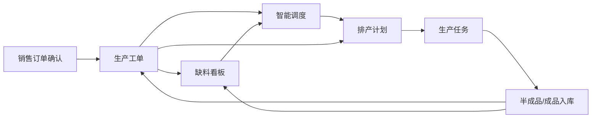
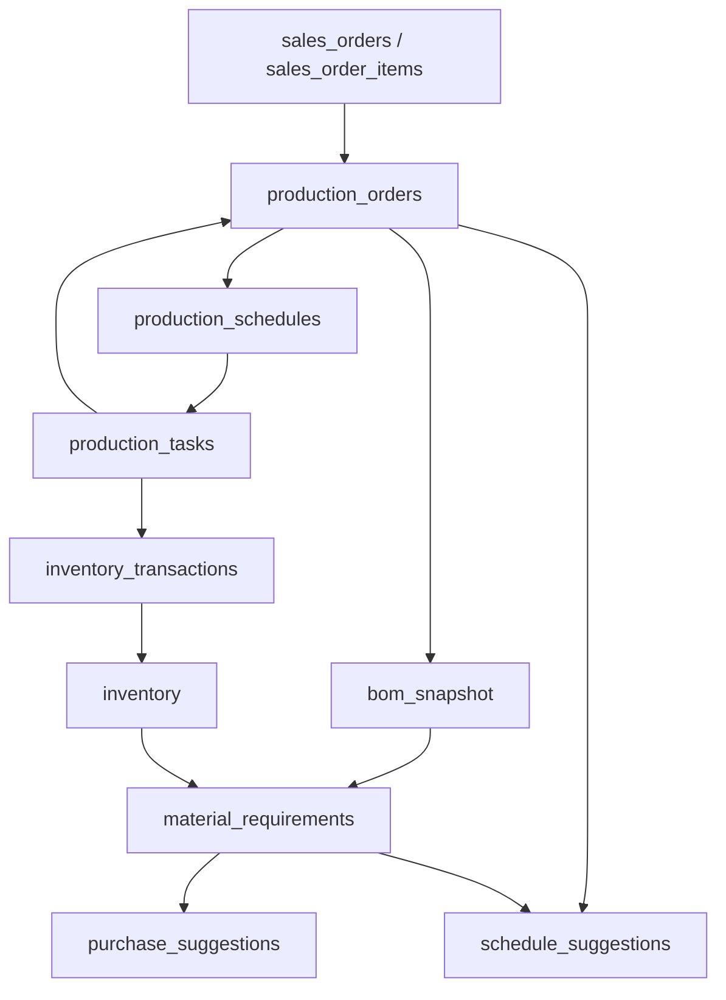

# 生产管理模块关系说明 - 2026-03-25

## 1. 目标

本文用于解释生产管理中以下 5 个子模块的关系、业务职责和数据流转：

1. 智能调度
2. 排产计划
3. 生产任务
4. 生产工单
5. 缺料看板

核心结论：

- `生产工单` 是生产侧主对象
- `缺料看板` 是工单执行前后的物料风险视图
- `智能调度` 是 AI 建议层，不是正式执行层
- `排产计划` 是主管确认后的正式计划
- `生产任务` 是工人实际执行的最小单元

---

## 2. 一句话理解 5 个模块

1. `生产工单`：我要做什么
2. `缺料看板`：做这张工单时缺不缺料
3. `智能调度`：AI 建议先做谁、谁更优先
4. `排产计划`：今天正式怎么排
5. `生产任务`：具体谁去做、做哪一道工序

---

## 3. 从业务流程看它们的先后关系

完整主链：

```text
销售订单确认
  -> 生产工单创建
  -> BOM 展开 / 生成物料需求
  -> 缺料检测
  -> 缺料则生成采购建议
  -> AI 生成调度建议
  -> 主管确认正式排产
  -> 生成生产任务
  -> 工人开始 / 报工 / 完工
  -> 半成品 / 成品入库
  -> 更新工单进度与状态
```

更直观地说：

- `生产工单` 决定“要生产哪些东西”
- `缺料看板` 决定“这些工单能不能顺利开工”
- `智能调度` 决定“优先建议怎么排”
- `排产计划` 决定“今天正式安排给谁、排到哪个工作站”
- `生产任务` 决定“工人今天具体干哪一个任务”

---

## 4. 模块职责拆解

### 4.1 生产工单

这是生产管理的中心模块。

来源：

- 销售订单确认后，系统按每个 SKU 明细生成独立生产工单

核心职责：

- 锁定本次生产所使用的 BOM 版本
- 绑定工艺模板
- 记录计划数量、计划完工日、优先级
- 作为后续排产、报工、缺料、入库的统一主键对象

创建时同时会发生：

1. 查询激活 BOM
2. 查询默认或最新工艺模板
3. 生成 BOM 快照
4. 写入 `production_orders`
5. 展开 BOM，写入 `material_requirements`

对应代码：

- [production-order.service.ts](/Users/kongwen/claude_wk/ai-software-company/services/api/src/modules/production/production-order.service.ts:104)

---

### 4.2 缺料看板

这是生产与采购的连接点。

它不是“生产执行页”，而是“物料风险总览页”。

核心职责：

- 汇总所有工单的物料需求
- 对比库存、预留、在途
- 识别哪些工单缺料、缺多少
- 提供一键生成采购建议入口

它依赖的核心数据：

- `material_requirements`
- `inventory`
- `purchase_suggestions`

缺料计算逻辑：

```text
净缺口 = 剩余需求量 - 当前可用库存 - 在途量
```

计算结果会回写：

- `material_requirements.qty_shortage`
- `material_requirements.status`
- `production_orders.material_status`

对应代码：

- [mrp.service.ts](/Users/kongwen/claude_wk/ai-software-company/services/api/src/modules/mrp/mrp.service.ts:123)
- [ShortageBoard.tsx](/Users/kongwen/claude_wk/ai-software-company/services/web/src/pages/production/ShortageBoard.tsx:16)

---

### 4.3 智能调度

这个模块最容易被误解。

它的真实定位是：

- `AI 建议层`
- 不是正式排产执行层

当前页面实际是一个“建议中心”：

- 左侧：采购建议
- 右侧：排产建议

对生产来说，它的核心职责是：

- 对待排产工单进行评分排序
- 综合交期、优先级、物料就绪度
- 推荐应优先处理的工单
- 推荐可分配的工人

它不会直接生成正式任务，不会直接下发给工人。

对应代码：

- [ScheduleSuggestionPage.tsx](/Users/kongwen/claude_wk/ai-software-company/services/web/src/pages/schedule/ScheduleSuggestionPage.tsx:2)
- [schedule-suggestion.service.ts](/Users/kongwen/claude_wk/ai-software-company/services/api/src/modules/schedule-suggestion/schedule-suggestion.service.ts:95)
- [production-suggestion.engine.ts](/Users/kongwen/claude_wk/ai-software-company/services/api/src/modules/schedule-suggestion/production-suggestion.engine.ts:100)

它的输出更像：

- 一份“优先级建议清单”
- 一份“推荐分配方案”

而不是：

- 正式排产单

---

### 4.4 排产计划

这是正式计划层。

核心职责：

- 针对某一天生成生产安排
- 把工单、工序、工人、工作站、计划日期真正组合起来
- 支持主管查看、调整、确认下发

这个模块比“智能调度”更靠执行。

它处理的是：

- 哪张工单今天排
- 哪个工序先做
- 分给哪个工人
- 占哪个工作站
- 是否冲突

后端调度器会：

1. 读取待排产工单
2. 读取工人与工作站资源
3. 按优先级和产能做分配
4. 生成计划
5. 确认后下发

对应代码：

- [scheduler.service.ts](/Users/kongwen/claude_wk/ai-software-company/services/api/src/modules/production/scheduler.service.ts:127)
- [SchedulePage.tsx](/Users/kongwen/claude_wk/ai-software-company/services/web/src/pages/production/SchedulePage.tsx:2)

对应交互文档：

- [interaction-spec-smart-factory.md](/Users/kongwen/claude_wk/ai-software-company/docs/interaction-spec-smart-factory.md:196)

---

### 4.5 生产任务

这是现场执行层。

它是排产结果被拆解后的最小执行单位。

面向对象：

- 工人
- 班组长
- 车间主管

核心职责：

- 查看今日任务
- 开始任务
- 上报完工数量
- 上报异常
- 挂起 / 恢复任务

这里的重点是：

- 工人不直接操作工单
- 工人操作的是任务

一个工单通常会对应多个工序任务，甚至同一工序会拆给多个人。

对应代码：

- [TaskPage.tsx](/Users/kongwen/claude_wk/ai-software-company/services/web/src/pages/production/TaskPage.tsx:2)

---

## 5. 5 个模块之间的关系图

### 5.1 页面关系图



说明：

- `生产工单` 是核心来源
- `缺料看板` 和 `智能调度` 都依赖工单
- `排产计划` 吸收工单与调度建议，形成正式执行方案
- `生产任务` 是排产下发后的执行结果
- 入库后又会反向影响工单进度和缺料状态

---

### 5.2 数据关系图



说明：

- 销售订单进入生产后先形成 `production_orders`
- 工单创建时基于 BOM 快照生成 `material_requirements`
- 缺料时生成 `purchase_suggestions`
- AI 调度侧会读取工单和齐料情况形成 `schedule_suggestions`
- 正式排产落到 `production_schedules`
- 任务下发后形成 `production_tasks`
- 报工完工产生库存流水 `inventory_transactions`
- 库存变化再回流影响缺料状态

---

## 6. 从“谁给谁喂数据”看这 5 个模块

### 6.1 生产工单 -> 缺料看板

工单创建后会展开出原材料需求。

所以缺料看板不是自己生成数据，它依赖工单展开后的 `material_requirements`。

没有工单，就没有缺料分析对象。

---

### 6.2 生产工单 + 缺料状态 -> 智能调度

AI 调度建议不是只看交期。

它还要看：

- 工单优先级
- 交期紧迫度
- 当前物料是否齐套

所以智能调度会消费：

- `production_orders`
- `material_requirements` / `material_status`
- 工人负载信息

---

### 6.3 智能调度 -> 排产计划

这里不是强制自动落单，而是“建议给主管看”。

主管可以：

- 参考 AI 建议
- 手工调整
- 确认正式下发

所以智能调度更像辅助决策，不是自动执行。

---

### 6.4 排产计划 -> 生产任务

排产计划是“班次级、日期级”的安排。

生产任务是“工人级、工序级”的执行单元。

可以理解成：

```text
排产计划 = 主管视角
生产任务 = 工人视角
```

排产一旦确认，系统就会把计划拆成具体任务并下发。

---

### 6.5 生产任务 -> 工单 / 库存 / 下道工序

任务完工后，不是只改任务状态。

系统还会自动触发：

1. 半成品入库
2. 解锁下道工序
3. 检查整张工单是否完工

对应代码：

- [workflow-engine.service.ts](/Users/kongwen/claude_wk/ai-software-company/services/api/src/modules/production/workflow-engine.service.ts:47)

这就是为什么“生产任务”是执行层，但会反向驱动整个生产闭环。

---

## 7. 按角色看各模块分别服务谁

### 7.1 销售 / 业务主管

主要关心：

- 订单是否已转工单
- 工单是否生产中
- 是否缺料影响交期

更多会看：

- `生产工单`
- `缺料看板`

---

### 7.2 车间主管

主要关心：

- 哪些工单待排
- AI 建议如何排序
- 今日怎么排
- 排产是否冲突

更多会看：

- `智能调度`
- `排产计划`
- `生产工单`

---

### 7.3 工人

主要关心：

- 今天做什么
- 先做哪道工序
- 怎么上报完工 / 异常

更多会看：

- `生产任务`

---

### 7.4 采购 / 供应链

主要关心：

- 哪些工单缺料
- 缺哪些原材料
- 是否已生成采购建议

更多会看：

- `缺料看板`

---

## 8. 为什么会“看不懂”

当前这个模块设计里有 3 个天然容易混淆的点。

### 8.1 “智能调度”名字像正式排产

但它实际上是建议层，不是执行层。

如果把它理解成：

- `AI 优先级建议`

就会清楚很多。

---

### 8.2 “排产计划”和“生产任务”都像在安排生产

但它们的粒度不同：

- `排产计划` 是主管排班
- `生产任务` 是工人执行

一个是计划，一个是执行。

---

### 8.3 “缺料看板”看起来像采购页，实际上是生产前置页

它虽然最后会驱动采购建议，但它的触发源头是生产工单。

所以它本质上是：

- 生产可执行性检查页

不是单纯采购页。

---

## 9. 最推荐的理解顺序

如果要快速理解生产模块，建议按下面顺序看：

1. `生产工单`
2. `缺料看板`
3. `智能调度`
4. `排产计划`
5. `生产任务`

因为真实业务顺序就是这样。

---

## 10. 和文档/代码的对应关系

### 10.1 文档

- 生产工单创建与 BOM 展开：
  - [sprint3-acceptance.md](/Users/kongwen/claude_wk/ai-software-company/docs/v2/sprint3-acceptance.md:110)
  - [sprint3-acceptance.md](/Users/kongwen/claude_wk/ai-software-company/docs/v2/sprint3-acceptance.md:126)
- 工序任务分配与排产：
  - [sprint3-acceptance.md](/Users/kongwen/claude_wk/ai-software-company/docs/v2/sprint3-acceptance.md:141)
- 工人报工：
  - [sprint3-acceptance.md](/Users/kongwen/claude_wk/ai-software-company/docs/v2/sprint3-acceptance.md:157)
- 缺料检测与采购建议：
  - [sprint3-acceptance.md](/Users/kongwen/claude_wk/ai-software-company/docs/v2/sprint3-acceptance.md:211)
  - [sprint3-acceptance.md](/Users/kongwen/claude_wk/ai-software-company/docs/v2/sprint3-acceptance.md:227)
  - [sprint3-acceptance.md](/Users/kongwen/claude_wk/ai-software-company/docs/v2/sprint3-acceptance.md:242)
- 每日排产查看与下发：
  - [interaction-spec-smart-factory.md](/Users/kongwen/claude_wk/ai-software-company/docs/interaction-spec-smart-factory.md:196)
- 原型流程：
  - [prototype-smart-factory-agent.md](/Users/kongwen/claude_wk/ai-software-company/docs/prototype-smart-factory-agent.md:1423)
  - [prototype-smart-factory-agent.md](/Users/kongwen/claude_wk/ai-software-company/docs/prototype-smart-factory-agent.md:1448)

### 10.2 页面

- 智能调度：
  - [ScheduleSuggestionPage.tsx](/Users/kongwen/claude_wk/ai-software-company/services/web/src/pages/schedule/ScheduleSuggestionPage.tsx:2)
- 排产计划：
  - [SchedulePage.tsx](/Users/kongwen/claude_wk/ai-software-company/services/web/src/pages/production/SchedulePage.tsx:2)
- 生产任务：
  - [TaskPage.tsx](/Users/kongwen/claude_wk/ai-software-company/services/web/src/pages/production/TaskPage.tsx:2)
- 生产工单：
  - [ProductionOrderPage.tsx](/Users/kongwen/claude_wk/ai-software-company/services/web/src/pages/production/ProductionOrderPage.tsx:1)
- 缺料看板：
  - [ShortageBoard.tsx](/Users/kongwen/claude_wk/ai-software-company/services/web/src/pages/production/ShortageBoard.tsx:2)

### 10.3 后端

- 工单创建：
  - [production-order.service.ts](/Users/kongwen/claude_wk/ai-software-company/services/api/src/modules/production/production-order.service.ts:104)
- 正式排产：
  - [scheduler.service.ts](/Users/kongwen/claude_wk/ai-software-company/services/api/src/modules/production/scheduler.service.ts:127)
- 任务完工工作流：
  - [workflow-engine.service.ts](/Users/kongwen/claude_wk/ai-software-company/services/api/src/modules/production/workflow-engine.service.ts:47)
- 缺料检测：
  - [mrp.service.ts](/Users/kongwen/claude_wk/ai-software-company/services/api/src/modules/mrp/mrp.service.ts:123)
- 调度建议：
  - [schedule-suggestion.service.ts](/Users/kongwen/claude_wk/ai-software-company/services/api/src/modules/schedule-suggestion/schedule-suggestion.service.ts:95)
  - [production-suggestion.engine.ts](/Users/kongwen/claude_wk/ai-software-company/services/api/src/modules/schedule-suggestion/production-suggestion.engine.ts:100)

---

## 11. 最终结论

如果只记一件事，就记这句：

```text
生产工单是主对象，
缺料看板检查能不能做，
智能调度给建议，
排产计划做正式安排，
生产任务负责实际执行。
```

这样看这 5 个模块，关系就不会乱。
